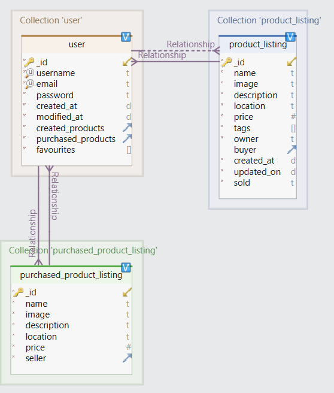

## SIMPLIFIED FORK FROM PROJECT REPOSITORY FOR DATABASE IMEPLEMENTATION DEADLINE (DL2)

### 1. Install Mongo community server and MongoDB Compass
https://www.mongodb.com/try/download/community

### 2. Clone this and create venv inside this folder
`virtualenv venv`

### 3. Open virtualenv and install requirements
```\venv\scripts\activate\```

```pip install -r requirements.txt```

### 4. Run the backend & database

```python main.py```

Database gets automatically populated with test data. Backend can be operated by Postman for example. Database can be viewed with installed MongoDB Compass

Database schema:

